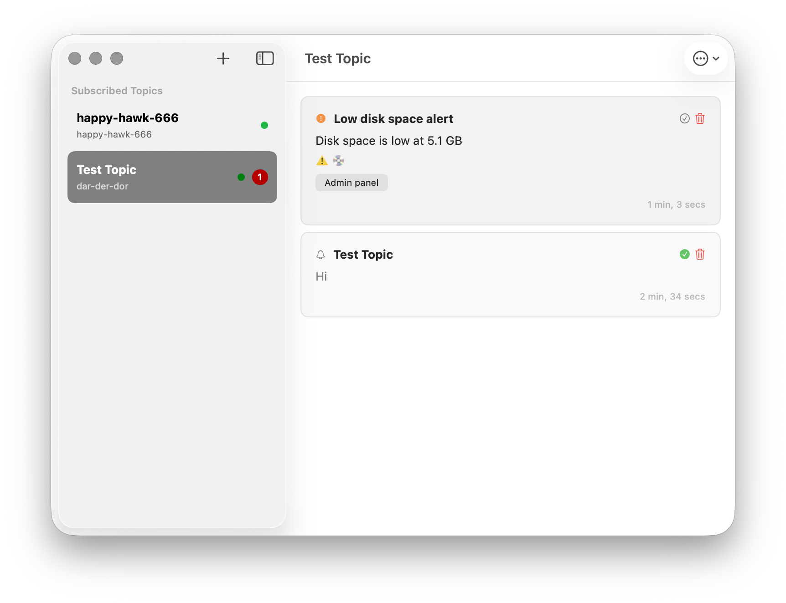

# Notify

[](https://github.com/maman/notify/releases)
[](LICENSE)

Get instant notifications on your Mac from anywhere — your server scripts, CI/CD pipelines, IoT devices, or any application. No complicated setup, no API keys, just simple HTTP requests.

**Built for developers, sysadmins, and power users who need reliable notifications from their tools and workflows.**



## Why Notify?

Stop checking dashboards and logs manually. With Notify, your scripts and services can reach you instantly:

- **Deployment finished?** Get notified the moment your CI/CD completes
- **Server error?** Instant alerts when your monitoring detects issues
- **Backup complete?** Confirm your cron jobs ran successfully
- **Long task done?** Know when that database migration or video render finishes

Unlike email alerts (slow, easily missed) or Slack (noisy, requires login), Notify delivers native macOS notifications in real-time with zero infrastructure setup.

## Download

**[Download for macOS](https://github.com/maman/notify/releases/latest)**

**Requirements:** macOS 15.0 (Sequoia) or later

## Quick Start

### 1. Install

Download and drag Notify to your Applications folder. Launch it — you'll see a bell icon in your menu bar.

### 2. Create Your First Topic

Click the bell icon → **Show Topics** → **+** button

- **Topic name**: Choose something unique like `john-alerts-a8f3` (topics are public on ntfy.sh, so make yours hard to guess)
- **Server**: Leave as `ntfy.sh` (or enter your own ntfy server URL)

Click **Subscribe**.

### 3. Send Your First Notification

Open Terminal and run:

```bash
curl -d "Hello from Notify!" ntfy.sh/your-topic-name
```

Replace `your-topic-name` with the topic you created. You'll see a macOS notification appear instantly.

### 4. Next Steps

Now try sending notifications from your own scripts:

```bash
# Notify when a task completes
./my-script.sh && curl -d "Task complete!" ntfy.sh/your-topic-name

# Alert on errors with high priority
./deploy.sh || curl -H "Priority: urgent" -d "Deploy failed!" ntfy.sh/your-topic-name
```

## Real-World Examples

### CI/CD Pipelines

```bash
# GitHub Actions notification
curl -H "Title: Deployment Complete" \
     -H "Priority: high" \
     -d "Production deployed from ${GITHUB_SHA:0:7}" \
     ntfy.sh/deploys
```

### Server Monitoring

```bash
# Cron job status
0 2 * * * /backup.sh && curl -d "Backup: $(du -sh /backups | cut -f1)" ntfy.sh/backups

# Disk space alert
if [ $(df / | awk 'NR==2 {print $5}' | tr -d '%') -gt 90 ]; then
  curl -H "Priority: urgent" -d "Disk usage critical!" ntfy.sh/alerts
fi
```

### Python Scripts

```python
import requests

def long_running_task():
    # ... processing ...
    pass

try:
    long_running_task()
    requests.post("https://ntfy.sh/my-alerts", data="Task completed!")
except Exception as e:
    requests.post("https://ntfy.sh/my-alerts",
                  data=f"Task failed: {e}",
                  headers={"Priority": "urgent"})
```

See the [ntfy documentation](https://ntfy.sh/docs/) for all publishing options including attachments, action buttons, and more.

## Features

### Native macOS Experience

- **Menu Bar Integration** — Always accessible, never clutters your Dock
- **Notification Center** — Works with macOS notifications including actionable "Mark as Read" button
- **Focus Mode Support** — Filter by topic and priority during Do Not Disturb
- **Siri & Shortcuts** — Voice control and automation workflows

### Reliable Connections

- **Auto-Reconnect** — Handles network changes, sleep/wake cycles, and connection drops automatically
- **Automatic Updates** — New features and bug fixes install in the background
- **Secure Credentials** — Passwords stored safely in macOS Keychain

### Flexible & Powerful

- **Multiple Topics** — Subscribe to as many notification channels as you need
- **Self-Hosted Support** — Works with ntfy.sh or your own private ntfy server
- **Enterprise Ready** — MDM support for managed app configuration
- **Deep Linking** — Open topics directly with [`ntfy://` URLs](docs/url-scheme.md)

## Siri & Shortcuts

Control Notify with your voice or build automations:

**Voice Commands:**

- "Hey Siri, how many unread in Notify"
- "Hey Siri, mark all Notify as read"
- "Hey Siri, subscribe to my-alerts in Notify"

**Shortcuts App:** Create workflows to subscribe to topics, check unread counts, or trigger actions based on time or location.

See the [Siri & Shortcuts documentation](docs/siri-shortcuts.md) for all available actions and automation examples.

## Focus Mode Integration

Configure Notify in **System Settings → Focus** to control which notifications break through:

- Allow notifications only from specific topics
- Set minimum priority thresholds (Normal, High, Urgent)
- Block all notifications during certain Focus modes

See the [Focus Mode documentation](docs/focus-mode.md) for detailed setup instructions.

## For Enterprise

Deploy Notify across your organization with Managed App Configuration (MDM):

- Pre-configure server URLs and topics
- Enforce launch at login settings
- Point to your organization's private ntfy server

See the [MDM Configuration Guide](docs/mdm-configuration.md) for setup instructions.

## Privacy & Security

- **No tracking** — Zero analytics or telemetry
- **No accounts** — No registration or personal information required
- **Keychain integration** — Passwords stored securely, never in plaintext
- **Open source** — Full source code available for audit
- **Local storage** — Messages stored only on your Mac

For maximum privacy, [self-host your ntfy server](https://ntfy.sh/docs/install/).

## FAQ

**Is this free?**
Yes, Notify is free and open source (GPLv3 license). The ntfy.sh service is also free with generous limits.

**Can I use my own server?**
Yes! Each topic can use a different server URL. Works with any ntfy-compatible server.

**Are topics private?**
Topics on ntfy.sh are public — anyone who knows the name can subscribe or send. Use unique topic names and add authentication for sensitive notifications, or self-host for complete control.

**What about iOS?**
Notify is macOS-only. For iOS, use the official [ntfy app](https://ntfy.sh/docs/subscribe/phone/).

## Troubleshooting

**Notifications not appearing?**

- Check System Settings → Notifications → Notify is enabled
- Verify your topic name matches exactly (case-sensitive)
- Ensure Notify shows "Connected" status for your topic

**Need help?** [Open an issue](https://github.com/maman/notify/issues)

## Building from Source

```bash
git clone https://github.com/maman/notify.git
cd notify

# Resolve dependencies
xcodebuild -project src/ntfy.xcodeproj -scheme Notify -resolvePackageDependencies

# Build
xcodebuild -project src/ntfy.xcodeproj -scheme Notify -configuration Release build
```

The built app will be at `build/Release/Notify.app`.

**Requirements:** Xcode 16.0 or later

## License

GPLv3

## Acknowledgments

- [ntfy](https://ntfy.sh) by Philipp C. Heckel
- [KeychainAccess](https://github.com/kishikawakatsumi/KeychainAccess) by kishikawakatsumi
- [Sparkle](https://sparkle-project.org/) for auto-updates
